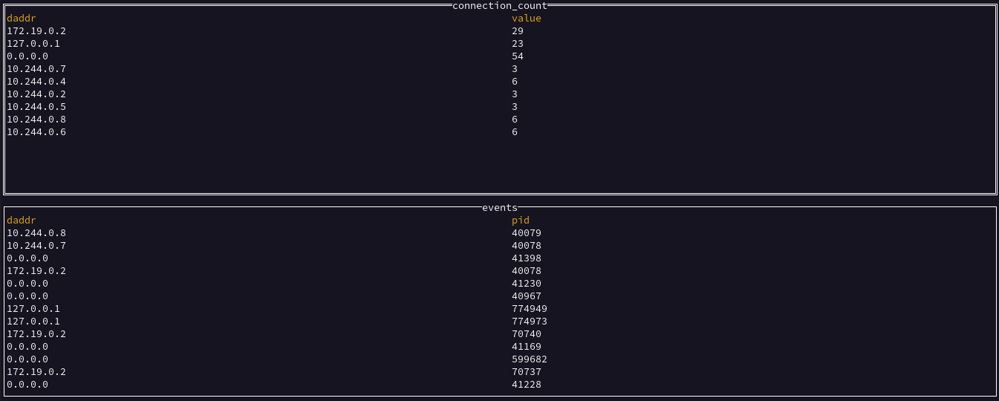

# Tutorial

## Prerequisites
Most of this tutorial can be run on linux or mac (with docker for desktop). The "run" part requires linux. To get a linux environment you can use our [vagrant VM](README.md#Development).

## Introduction

Let's get started writing our first `eBPF` probe. This is super simple using the interactive `bee init` command. But first let's create a quick workspace directory using `mkdir ebpf-test && cd ebpf-test`.

Now let's run `bee init`!

## bee 

The first option you will be confronted with is the language with which you will develop your probe. Currently only `C` is supported, but support for `Rust` is planned as well.
```bash
? What language do you wish to use for the filter: 
  ▸ C
```
Next you will be asked for the type of global map you would like to use. Maps are the instrument through which `eBPF` user space, and kernel space programs are able to communicate with each other. More detailed information on these maps, as well as the different types of maps which are available can be found in the `eBPF maps` section of the `BPF` [linux documentation](https://man7.org/linux/man-pages/man2/bpf.2.html). For the sake of this demo we will arbitrarily decide on `RingBuffer`.

```bash
? What type of map should we initialize: 
    RingBuffer
  ▸ HashMap
```

After deciding on a map type, you will be asked to decide on an output format. This step is the first that gets into the detail and magic of `bee`. Normally developing `eBPF` applications requires writing user space, and kernel space code. However, with `bee` you only need to develop the kernel space code, and then `bee` can automatically handle and output the data in your specified format. The 2 main output types available currently are: `stats`, and `print`. More information on these can be found in the [output formats](#Output-Formats) section below. We will be choosing `print` as a simple example.

```bash
? What type of output would you like from your map: 
  ▸ print
    counter
    gauge
```
Finally we will decide on our program file location.
```bash
✔ BPF Program File Location: probe.c
```
The output file `probe.c` should now have the following content:
```C
#include "vmlinux.h"
#include "bpf/bpf_helpers.h"
#include "bpf/bpf_core_read.h"
#include "bpf/bpf_tracing.h"
#include "solo_types.h"

// 1. Change the license if necessary 
char __license[] SEC("license") = "Dual MIT/GPL";

struct event_t {
	// 2. Add rinbuf struct data here.
} __attribute__((packed));

// This is the definition for the global map which both our
// bpf program and user space program can access.
// More info and map types can be found here: https://www.man7.org/linux/man-pages/man2/bpf.2.html
struct {
	__uint(max_entries, 1 << 24);
	__uint(type, BPF_MAP_TYPE_RINGBUF);
	__type(value, struct event_t);
} events SEC(".maps.print");


SEC("kprobe/tcp_v4_connect")
int BPF_KPROBE(tcp_v4_connect, struct sock *sk)
{
// Init event pointer
	struct event_t *event;

	// Reserve a spot in the ringbuffer for our event
	event = bpf_ringbuf_reserve(&events, sizeof(struct event_t), 0);
	if (!event) {
		return 0;
	}

	// 3. set data for our event,
	// For example:
	// event->pid = bpf_get_current_pid_tgid();

	bpf_ringbuf_submit(event, 0);

	return 0;
}
```

There's quite a bit of content in this file, so let's dive in!


This program is very similar to a regular [libbpf-tools](https://github.com/iovisor/bcc/blob/master/libbpf-tools/tcpconnect.bpf.c) program code. We'll review the code, and then point-out some differences from libbpf programs.

The first interesting part:
```C
#include "solo_types.h"
```
This header file includes types that `bee` can automatically interpret and display. More on this shortly.

Let's discuss the next part:
```C
struct {
	__uint(max_entries, 1 << 24);
	__uint(type, BPF_MAP_TYPE_RINGBUF);
	__type(value, struct event_t);
} events SEC(".maps.print");
```

This defines a BPF map of type ring-buffer. A ring-buffer map is commonly used to stream events from 
kernel space to user space. The kernel eBPF probe writes to the wring buffer, and a user-mode program can asynchronously read events from the buffer.

Note the section the map is in: `.maps.print` - this has special meaning in `bee` - it instructs it to display this map as a stream of events (think logs and not metrics).

Note also that unlike libbpf ring buffer map, this one has a `__type` defined. This allows `bee` to automatically output the events written to the map. 

The final part to discuss now, is this part:

```C
SEC("kprobe/tcp_v4_connect")
int BPF_KPROBE(tcp_v4_connect, struct sock *sk)
{
```
This defines a kprobe that will be attached to `tcp_v4_connect`. This is not different from libbpf.


## Write Some Code

Fill in the event struct, and add fields to log the destination address and process id that attempts to make a connection:
```C
struct event_t {
	ipv4_addr daddr;
	u32 pid;
} __attribute__((packed));
```

Also, let's add another map, that defines the number of total connections per address. Add the following struct before the probe:

```C
struct dimensions_t {
	ipv4_addr daddr;
} __attribute__((packed));

struct {
	__uint(type, BPF_MAP_TYPE_HASH);
	__uint(max_entries, 8192);
	__type(key, struct dimensions_t);
	__type(value, u64);
} connection_count SEC(".maps.counter");
```

Note the `ipv4_addr` type. It is defined in `solo_types.h`. While it is simply defined to be a `u32`, this type definition is a hint to `bee` to format this field as an IPv4 address.

Now, let's define the probes code:

```C
SEC("kprobe/tcp_v4_connect")
int BPF_KPROBE(tcp_v4_connect, struct sock *sk, struct sockaddr *uaddr) {
	struct event_t *event;
	struct dimensions_t hash_key = {};
	__u32 daddr;
	u64 counter;
	u64 *counterp;

	// read in the destination address
	struct sockaddr_in *usin = (struct sockaddr_in *)uaddr;
	daddr = BPF_CORE_READ(usin, sin_addr.s_addr);

	// Reserve a spot in the ringbuffer for our event
	event = bpf_ringbuf_reserve(&events, sizeof(struct event_t), 0);
	if (!event) {
		return 0;
	}
	// 3. set data for our event
	event->pid = bpf_get_current_pid_tgid();
	event->daddr = daddr;
	// submit the event (this makes it available for consumption)
	bpf_ringbuf_submit(event, 0);

	// increment the counter for this address
	hash_key.daddr = daddr;
	counterp = bpf_map_lookup_elem(&connection_count, &hash_key);
	if (counterp) {
		__sync_fetch_and_add(counterp, 1);
	} else {
		// we may miss N events, where N is number of CPUs. We may want to 
		// fix this for prod, by adding another lookup/update calls here.
		// we skipped these for brevity
		counter = 1;
		bpf_map_update_elem(&connection_count, &hash_key, &counter, BPF_NOEXIST);
	}

	return 0;
}
```
<details>
<summary>
See full source code here
</summary>

```C
#include "vmlinux.h"
#include "bpf/bpf_helpers.h"
#include "bpf/bpf_core_read.h"
#include "bpf/bpf_tracing.h"
#include "solo_types.h"

// 1. Change the license if necessary 
char __license[] SEC("license") = "Dual MIT/GPL";

struct event_t {
	ipv4_addr daddr;
	u32 pid;
} __attribute__((packed));

struct dimensions_t {
	ipv4_addr daddr;
} __attribute__((packed));

struct {
	__uint(type, BPF_MAP_TYPE_HASH);
	__uint(max_entries, 8192);
	__type(key, struct dimensions_t);
	__type(value, u64);
} connection_count SEC(".maps.counter");

// This is the definition for the global map which both our
// bpf program and user space program can access.
// More info and map types can be found here: https://www.man7.org/linux/man-pages/man2/bpf.2.html
struct {
	__uint(max_entries, 1 << 24);
	__uint(type, BPF_MAP_TYPE_RINGBUF);
	__type(value, struct event_t);
} events SEC(".maps.print");

SEC("kprobe/tcp_v4_connect")
int BPF_KPROBE(tcp_v4_connect, struct sock *sk, struct sockaddr *uaddr) {
	// Init event pointer	
	struct event_t *event;
	struct dimensions_t hash_key = {};
	__u32 daddr;
	u64 counter;
	u64 *counterp;

	// read in the destination address
	struct sockaddr_in *usin = (struct sockaddr_in *)uaddr;
	daddr = BPF_CORE_READ(usin, sin_addr.s_addr);

	// Reserve a spot in the ringbuffer for our event
	event = bpf_ringbuf_reserve(&events, sizeof(struct event_t), 0);
	if (!event) {
		return 0;
	}
	// 3. set data for our event
	event->pid = bpf_get_current_pid_tgid();
	event->daddr = daddr;
	// submit the event (this makes it available for consumption)
	bpf_ringbuf_submit(event, 0);

	// increment the counter for this address
	hash_key.daddr = daddr;
	counterp = bpf_map_lookup_elem(&connection_count, &hash_key);
	if (counterp) {
		__sync_fetch_and_add(counterp, 1);
	} else {
		// we may miss N events, where N is number of CPUs. We may want to 
		// fix this for prod, by adding another lookup/update calls here.
		// we skipped these for brevity
		counter = 1;
		bpf_map_update_elem(&connection_count, &hash_key, &counter, BPF_NOEXIST);
	}

	return 0;
}
```
</details>
## Build it!

Use the `bee` tool to compile your program and store it as an OCI image:
```shell
bee build probe.c my_probe:v1
```

Note: The command above uses a `docker` build container to simplify building your code. If you use `podman` instead of docker, just add `--builder podman` to the command above.

You can see all your local probes with the `list` command:
```shell
bee list
Name                                        | OS      | OS Version             | Arch   
my_probe:v1                                 | Linux   | 5.15.4-201.fc35.x86_64 | x86_64
```

## Run it!

Note on permissions - to load a bpf program, one needs elevated permissions.
We can use `sudo` to run `bee` as root, but then `bee` will not be able to find local images that were built in the context of a regular user. To work around this, we can grant the `bee` executable the following capabilities:
```shell
sudo setcap cap_sys_resource,cap_sys_admin+eip $(which bee)
```
so it has the permissions it needs in the context of a regular user.

To run, simply use this command:
```shell
bee run my_probe:v1
```

`bee` will by default open a terminal UI and display the events coming from your probe. If you don't see anything, try running some `curl` or `wget` commands from a different terminal!

It should look something like this:



## Collaborate!

You can push and pull probes from any OCI compatible registry, allowing you to use probes others have written with just one line of shell script!

In fact, you can try running some of the programs we've already pushed right now!
```
bee run ghcr.io/solo-io/bumblebee/tcpconnect:0.0.3
```

This command automatically pulls the remote bpf program and runs it!

You can also push images to an OCI compliant registry, and share them with the community! As for authentication, `bee` will automatically pick-up your docker authentication settings. You can also run `bee login` (this stores the credentials **unencrypted** in `~/.bumblebee/config.json`), or provide the credentials in the command line.

To login to GHCR for example, run:
```
export GITHUB_USER=<You github user name>
export GITHUB_TOKEN=<You github personal access token>
echo $GITHUB_TOKEN | go run bee/main.go login -u $GITHUB_USER --password-stdin ghcr.io
```

If you don't have access to a registry, you can also start a local registry for testing purposes like so:
```
docker run --rm -p 5000:5000 registry:2
```

Once you have access to a registry, You can use `bee tag`, `bee push` and `bee pull` as you would with `docker`.

For example, let's re-tag our image from above and push it:

```
bee tag my_probe:v1 localhost:5000/my_probe:v1
bee push localhost:5000/my_probe:v1
```
Another example, that uses google container registry:

```
bee tag my_probe:v1 gcr.io/<YOUR PROJECT ID>/my_probe:v1
bee push gcr.io/<YOUR PROJECT ID>/my_probe:v1
```

## Summary

We've just gone over how `bee` can help you harness eBPF's power to enable observability - whether on your own, or using a pre-made probe create by the community.
With `bee` we tried to help you gain the benefits of eBPF while minimizing the learning curve and boilerplate code. We would love to hear your feedback!